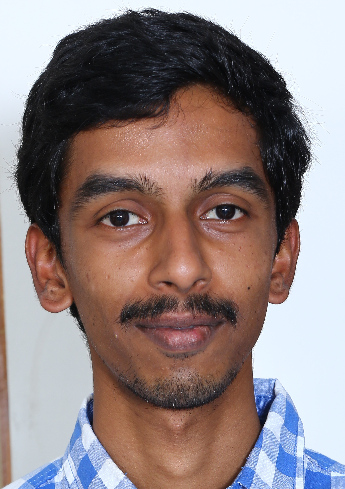

# Vachan Potluri

</img>

I am a PhD research scholar in Mechanical Engineering Department, IIT Bombay; working with [Prof. Bhanchandra Puranik](https://www.me.iitb.ac.in/?q=faculty/Prof.%20Bhalchandra%20Puranik) and [Prof. Kowsik Bodi](https://www.aero.iitb.ac.in/home/people/faculty/kbodi).

We are working on performing high order simulations of hypersonic shock-boundary layer interactions, using the discontinuous Galerkin method.

## Academic background
- B.Tech, Mechanical Engineering Department, IIT Bombay, 2018.

## Courses taken during PhD
- Advanced Heat transfer
- Fluid Dynamics
- Mathematical Models in Engineering
- Galerkin Methods for Fluid Dynamics
- High Performance Scientific computing
- Magnetohydrodynamics and its Engineering Applications
- Particle Methods for Fluid Flow Simulation

## Related documents
- [Presentation used for Dec 2020 review](review_dec_2020_presentation.pdf)
- [Presentation used for Dec 2021 review](review_dec_2021_presentation.pdf)
- [Spring 2021 teaching certificate](teaching_certificate_spring2021.pdf)
- [Autumn 2021 teaching certificate](teaching_certificate_autumn2021.pdf)
- [Spring 2022 teaching certificate](teaching_certificate_spring2022.pdf)

